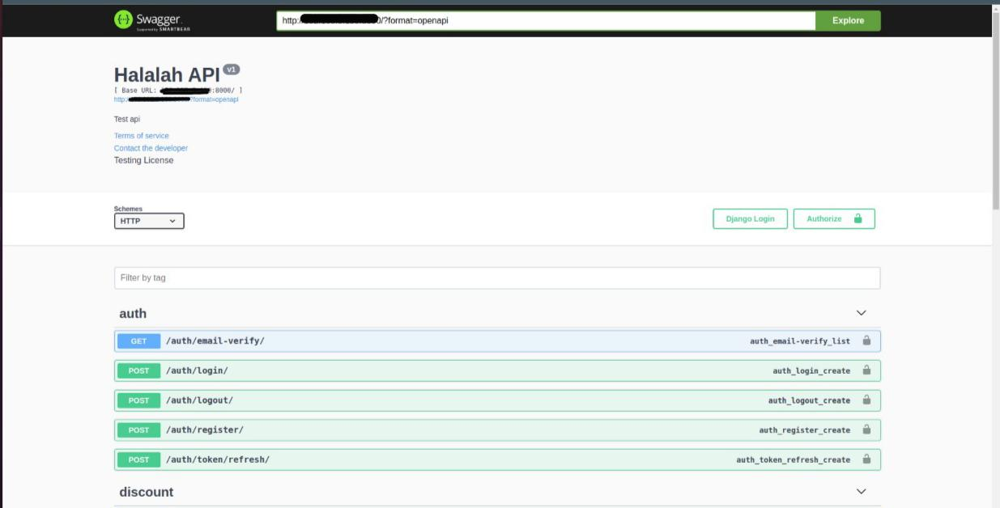

<p align="center">

</p>

# Halalah Backend Setup

### Welcome to Halalah, this is the **_first step_** to start the Halalah app, we will take you through it step by step, for the backend we used Django rest frame work with a couple more librarie as listed in [This document]().

---


---

## # Prerequsits :

- Virtual env
- Pip
- Python 3
- Code editor

---

## # Set up:

#### 1 - Clone the repository.

#### 2 - Create the backend folder.

#### 3 - Open the terminal.

#### 4 - Create a virtual enviroment.

```bash
virtualenv <Name>
```

#### 5 - Activate the virtual environment

```bash
source env/bin/activate
```

#### 6 - Install Django

```bash
pip install django
```

#### 7 - Move the halalahapp to the backend folder

#### 8 - Cd to the app

```bash
cd halalahapp
```

#### 9 - Install decouple to generate the secret key generator

```bash
pip install python-decouple
```

#### 10 - Generate a secret key

```bash
python3 generate_secret_key
```

#### 11 - Open your code editor

#### 12 - Create a .env file in halalahapp

#### 13 - Paste the secret key in the following order and save

```bash
SECRET_KEY='<the generated key>'
```

#### 14 - Install the requirements

```bash
pip install -r requirements.txt
```

#### 15 - Make migrations

```bash
python3 manage.py makemigrations
```

#### 16 - Migrate

```bash
 python3 manage.py migrate
```

#### 17 - Run the django server on your local ip on port 8000

```bash
python3 manage.py runserver 0.0.0.0:8000
```

#### if it is a sccess you shoud see this page when you follow the link



---

#### And thats it , After the backend setup you should be ready to set up the frontend

## Thank you.
